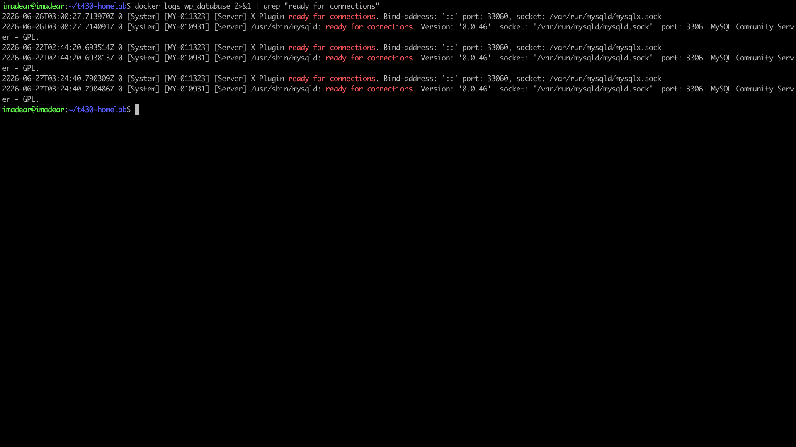
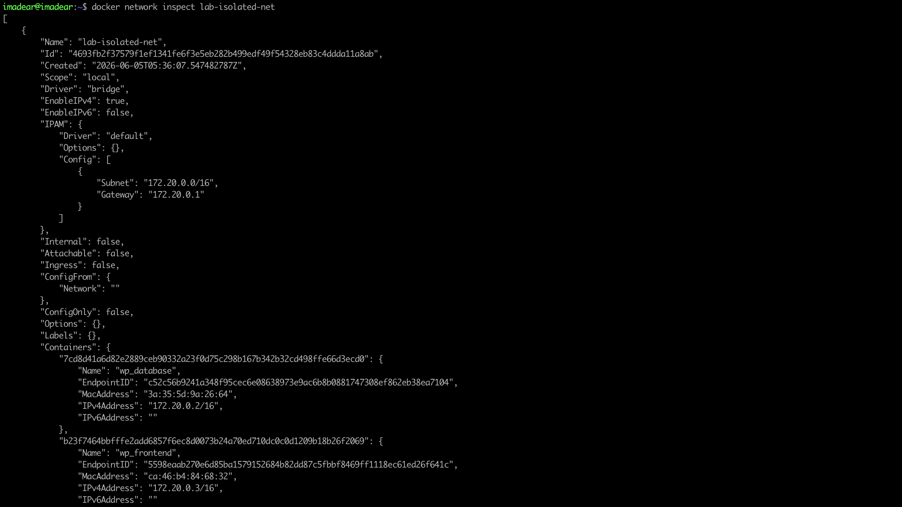
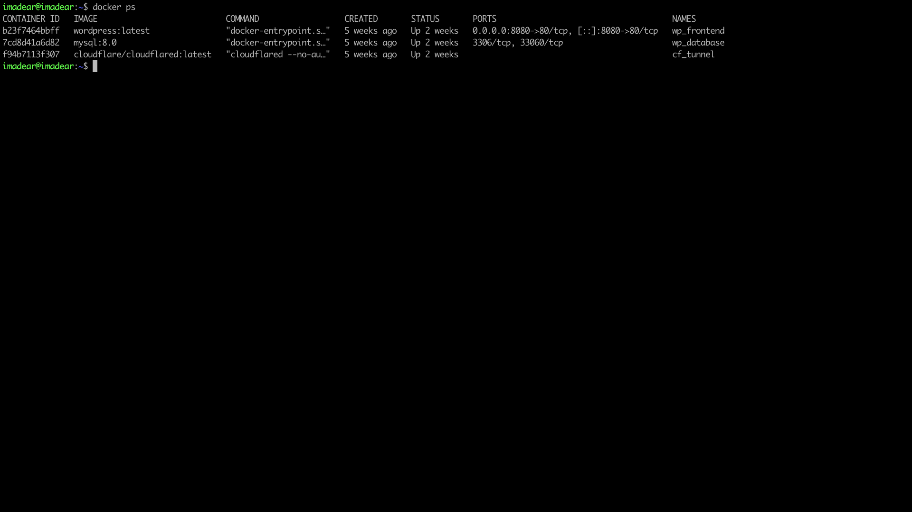

# 02 — WordPress + MySQL

**Stack:** `wordpress:latest` + `mysql:8.0` via Docker Compose on `lab-isolated-net`.
Credentials externalized to `.env`; both containers volume-mapped for persistence.

---

## Evidence

### Live Site
> Browse to `https://wp.madearlabs.com` in a clean browser session.
> Expected: WordPress front page loads over HTTPS with valid padlock.

<!-- Drop screenshot here and update the filename -->

---

### MySQL Ready
> Command: `docker logs wp_database 2>&1 | grep "ready for connections"`
> Expected: `[Server] ready for connections` line confirming DB bootstrap.

<!-- Drop screenshot here and update the filename -->

---

### Network Isolation Proof
> Command: `docker network inspect lab-isolated-net`
> Expected: both `wp_database` and `wp_frontend` listed as attached containers.

<!-- Drop screenshot here and update the filename -->

---

### Running Stack
> Command: `docker ps`
> Expected: both containers Up, no host-port bindings on port 80/3306 exposed to 0.0.0.0.

<!-- Drop screenshot here and update the filename -->

