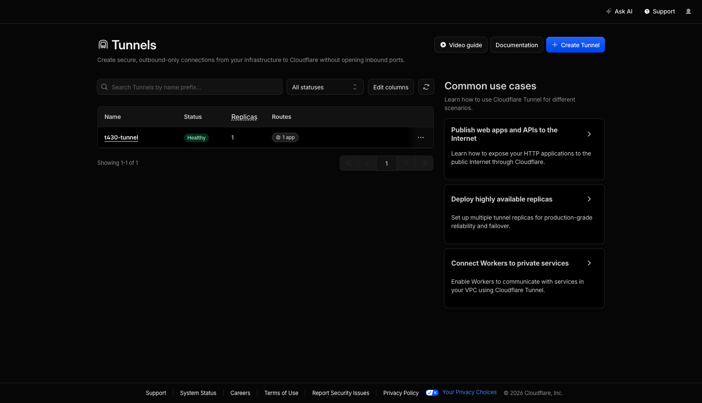
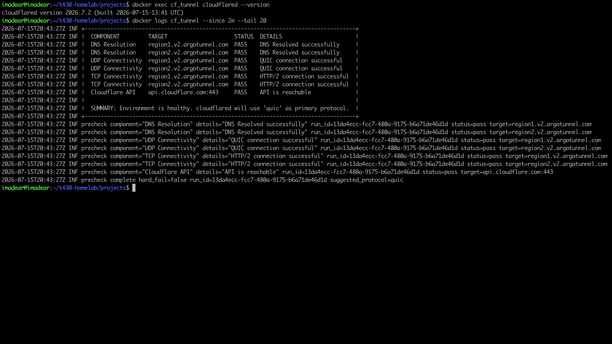
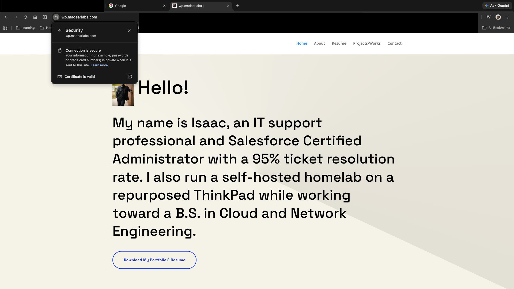

# 03 — Cloudflare Tunnel (Zero Trust Ingress)

**Stack:** Containerized `cloudflared` agent on `lab-isolated-net`.
Public subdomain `wp.madearlabs.com` routed inbound via outbound tunnel — no open server ports.

---

## Evidence

### Zero Trust Dashboard — Tunnel Healthy
> Cloudflare Zero Trust → Access → Tunnels.
> Expected: tunnel listed as **HEALTHY** (green status indicator).

<!-- Drop screenshot here and update the filename -->

---

### Tunnel Container Logs
> Command: `docker logs cf_tunnel`
> Expected: lines showing registered connections to Cloudflare edge nodes.
> Scrub: mask any `TUNNEL_TOKEN` values visible in env printouts.

<!-- Drop screenshot here and update the filename -->

---

### Public HTTPS Padlock
> Browse to `https://wp.madearlabs.com` and open browser cert/padlock details.
> Expected: valid cert, issued by a CA (Let's Encrypt or Cloudflare), no warnings.

<!-- Drop screenshot here and update the filename -->

