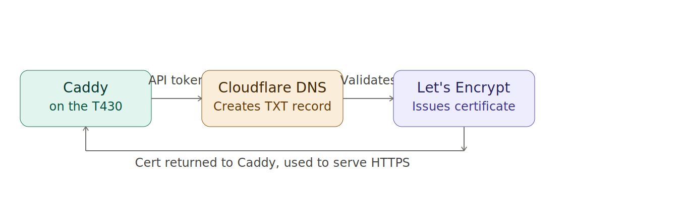
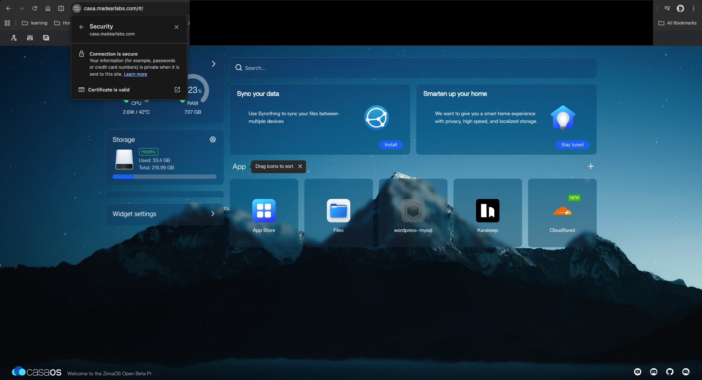
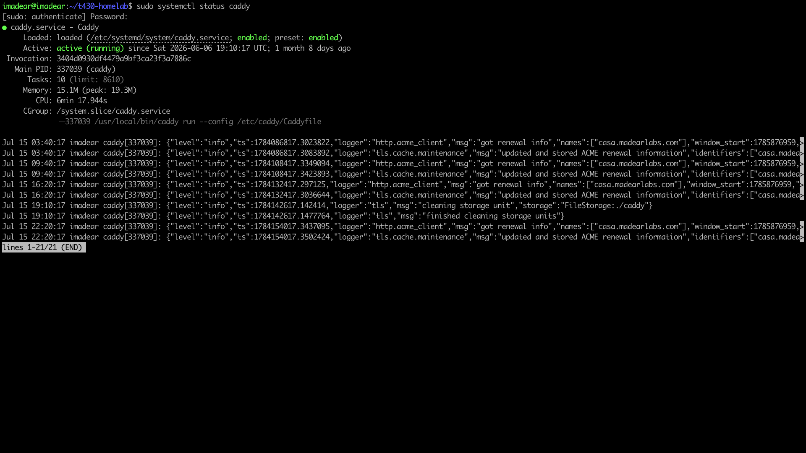
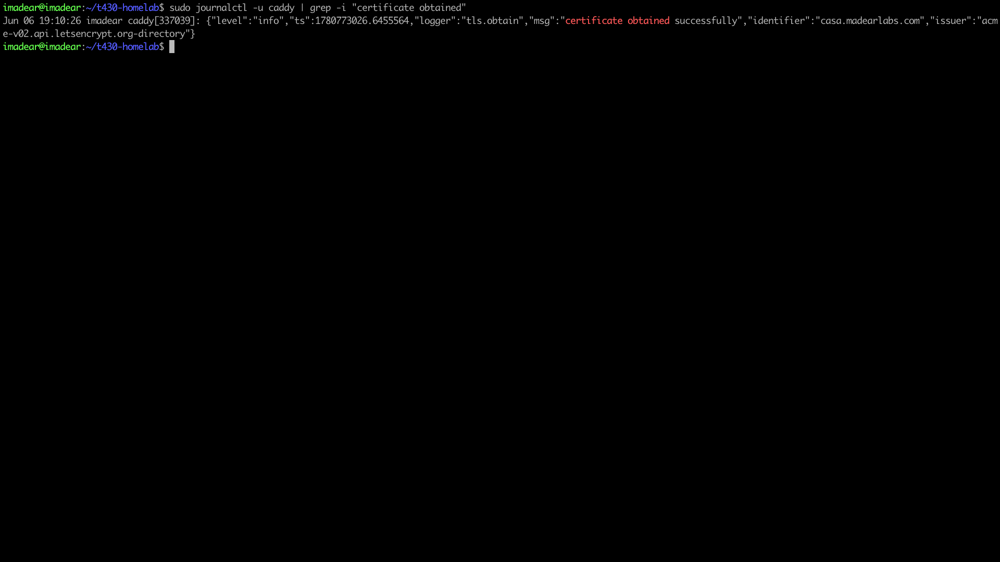

# 04 — Caddy + Cloudflare DNS-01 TLS

**Stack:** Caddy v2 compiled with `caddy-dns/cloudflare` plugin via `xcaddy`.
Automatic Let's Encrypt cert issued via DNS-01 challenge — no port 80 required.
CasaOS dashboard reachable at `https://casa.madearlabs.com` with valid TLS.

---

## Architecture

Caddy proves domain ownership by creating a DNS TXT record through the
Cloudflare API; Let's Encrypt validates it and returns the certificate —
no inbound port ever opens.

---

## Evidence

### Padlock + Certificate Details
> Browse to `https://casa.madearlabs.com`, click the padlock, view certificate.
> Expected: issued to `casa.madearlabs.com`, valid, issuer Let's Encrypt.

<!-- Drop screenshot here and update the filename -->

---

### Caddy Service Status
> Command: `systemctl status caddy`
> Expected: `active (running)` with no error lines.

<!-- Drop screenshot here and update the filename -->

---

### Certificate Obtained (Journal)
> Command: `journalctl -u caddy --no-pager | grep -i "certificate\|obtain\|issued"`
> Expected: line confirming the cert was obtained/renewed for `casa.madearlabs.com`.
> Scrub: ensure no Cloudflare API token appears in the log output.

<!-- Drop screenshot here and update the filename -->

