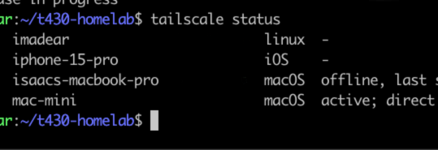
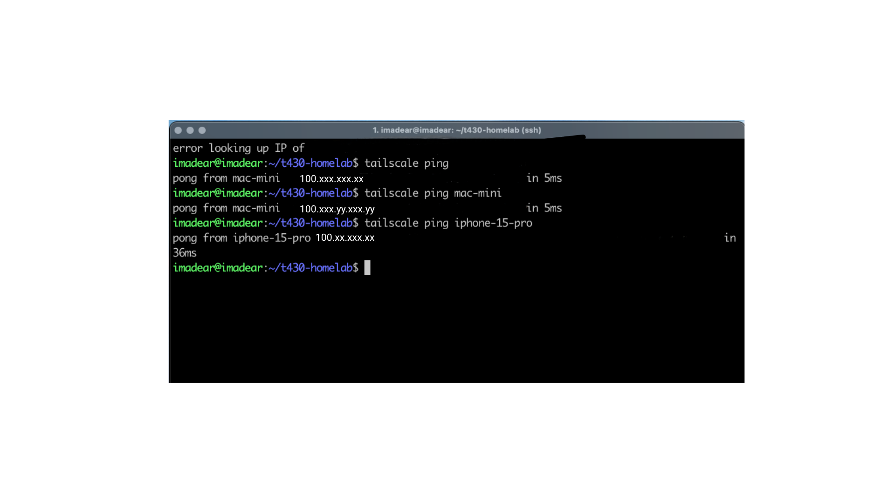
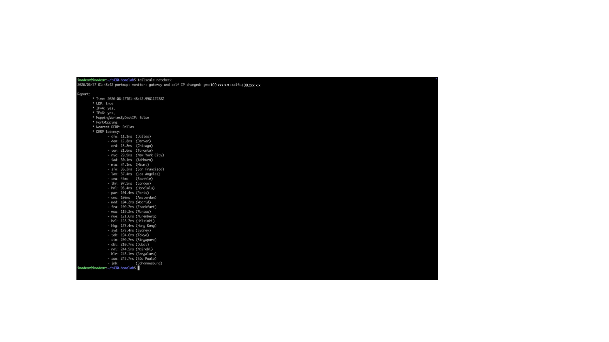

# 05 — Tailscale Mesh VPN

**Topology:** Flat encrypted mesh over cellular/WAN — four nodes connected via `100.x.y.z` CGNAT range.
Remote mobile system triage validated via Termius (iPhone 15 Pro → T430).

---

## Evidence

### Four-Node Status
> Command to run on the T430:
> ```bash
> tailscale status
> ```
> Expected: all four nodes listed as `active` — `t430-server`, `macbook-pro`, `mac-mini`, `iphone-15-pro`.
> Scrub: mask the `100.x.y.z` Tailscale IPs before committing (blur or replace in the image).

<!-- Replace placeholder filename with your actual screenshot filename -->


---

### End-to-End Connectivity Proof
> Command to run on the T430 (ping another node by its Tailscale IP):
> ```bash
> tailscale ping <macbook-or-mac-mini-tailscale-ip>
> ```
> Expected: `pong from <hostname> (<100.x.y.z>) via <relay-or-direct> in Xms` — confirms
> encrypted tunnel is live, not just registered.
> Scrub: mask the `100.x.y.z` IP.

<!-- Replace placeholder filename with your actual screenshot filename -->


---

### Network Health Check
> Command to run on the T430:
> ```bash
> tailscale netcheck
> ```
> Expected: UDP enabled, DERP latency table, preferred DERP region shown.
> This proves the node's WAN/NAT traversal posture — useful context for the mesh design.

<!-- Replace placeholder filename with your actual screenshot filename -->

