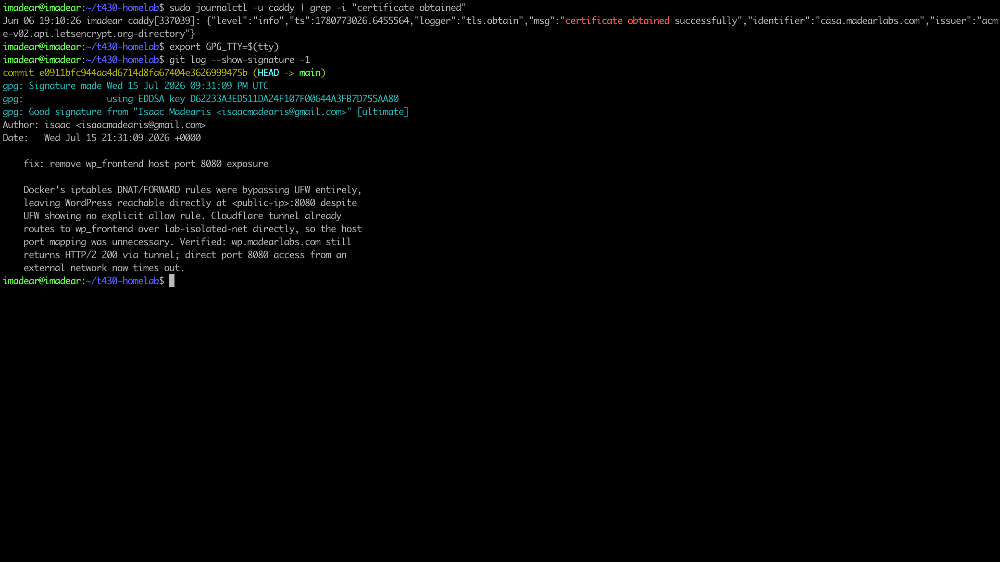

# 06 — GPG Commit Signing

**Key:** Ed25519 keypair, key ID `644A3FB7D755AA80`.
All commits are cryptographically signed — enforced globally via `commit.gpgsign=true`.
Pinentry is bound to the active SSH TTY via `export GPG_TTY=$(tty)` before each session.

---

## Evidence

### Pinentry Prompt Over SSH
> Trigger a signed commit over a Tailscale SSH session.
> Expected: the ncurses pinentry dialog appears in the terminal, prompting for the GPG passphrase.
> This screenshot itself is the "cryptographic seal" checkpoint from the engineering contract.

<!-- Drop screenshot here and update the filename -->

---

### Signed Commit Log
> Command: `git log --show-signature -3`
> Expected: `gpg: Good signature from "..."` and key ID `644A3FB7D755AA80` for recent commits.

<!-- Drop screenshot here and update the filename -->

