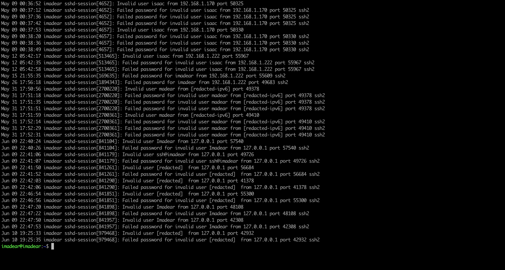
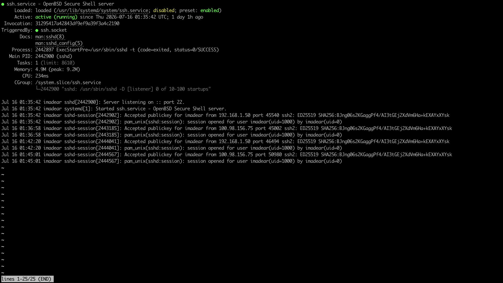

# 07 — SSH Hardening (Key-Only Auth + Tailscale-Scoped Ingress)

**Status:** Runbook / Pending Apply

Lock down `sshd` so brute-force credential attempts become impossible and the
listener is reachable only over the Tailscale mesh — not the home LAN.

---

## Why (Trigger)

Routine `systemctl status ssh` review surfaced a burst of **failed login attempts
originating from `127.0.0.1`** (localhost), fired in the same minute `sshd` started.
Notable signal: the attempted usernames were **derived from the operator's own
identity** (account-name and email variants), not a generic botnet wordlist — i.e.
a local credential-enumeration pattern rather than inbound WAN noise.

Source process was not pinned during the burst (closed before capture; root needed
for the localhost client PID). Rather than chase a transient, the response is to
remove the attack surface entirely:

1. **Key-only auth** → password guessing has nothing to guess.
2. **Tailscale-scoped ingress** → port 22 is unreachable from the LAN/WAN.

> Aligns with the Network Boundary Isolation + Production Zero-Interference
> guardrails: SSH currently binds `0.0.0.0:22` (all interfaces); it should ride
> the encrypted mesh only.

---

## Runbook

### Step 1 — Confirm you can log in with a key first (do NOT skip)
> A key must already work over Tailscale before disabling passwords, or you can
> lock yourself out of the headless node.
```bash
# from a client, prove key auth works:
ssh -o PasswordAuthentication=no imadear@t430-server   # should succeed via key
```

### Step 2 — Disable password authentication (key-only)
```bash
echo 'PasswordAuthentication no' | sudo tee /etc/ssh/sshd_config.d/10-hardening.conf
sudo sshd -t && sudo systemctl restart ssh    # -t validates config before restart
```

### Step 3 — Scope port 22 to the Tailscale interface only
```bash
sudo ufw delete allow 22/tcp                            # remove the broad rule
sudo ufw allow in on tailscale0 to any port 22 proto tcp
sudo ufw status numbered
```

### Step 4 — Verify the new posture
```bash
# password auth should now be refused:
ssh -o PreferredAuthentications=password -o PubkeyAuthentication=no \
    imadear@t430-server                                 # expect: Permission denied

systemctl status ssh                                    # still active (running)
```

### Rollback (if locked out — run at the physical console / Tailscale SSH)
```bash
sudo rm /etc/ssh/sshd_config.d/10-hardening.conf
sudo systemctl restart ssh
sudo ufw allow 22/tcp
```

---

## Evidence

### Before — Localhost Attempts in the Journal
> Command: `journalctl -u ssh --no-pager | grep -E "Invalid user|Failed password"`
> Expected: failed attempts from `127.0.0.1`.
> Scrub: redact the literal email/username strings before committing the image.

<!-- Drop screenshot here and update the filename -->


---

### After — Password Auth Disabled
> Command: `sudo sshd -T | grep -i passwordauthentication`
> Expected: `passwordauthentication no`.


---

### After — UFW Scoped to tailscale0
> Command: `sudo ufw status numbered`
> Expected: a rule allowing `22/tcp` only `on tailscale0`; no broad `22/tcp ALLOW Anywhere`.

<!-- Drop screenshot here and update the filename -->


---

### After — Service Healthy
> Command: `systemctl status ssh`
> Expected: `active (running)`, `sshd -t` pre-start check passed.

<!-- Drop screenshot here and update the filename -->

